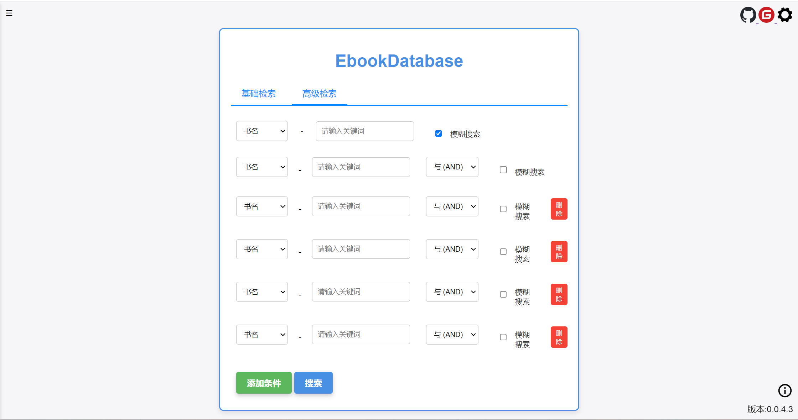
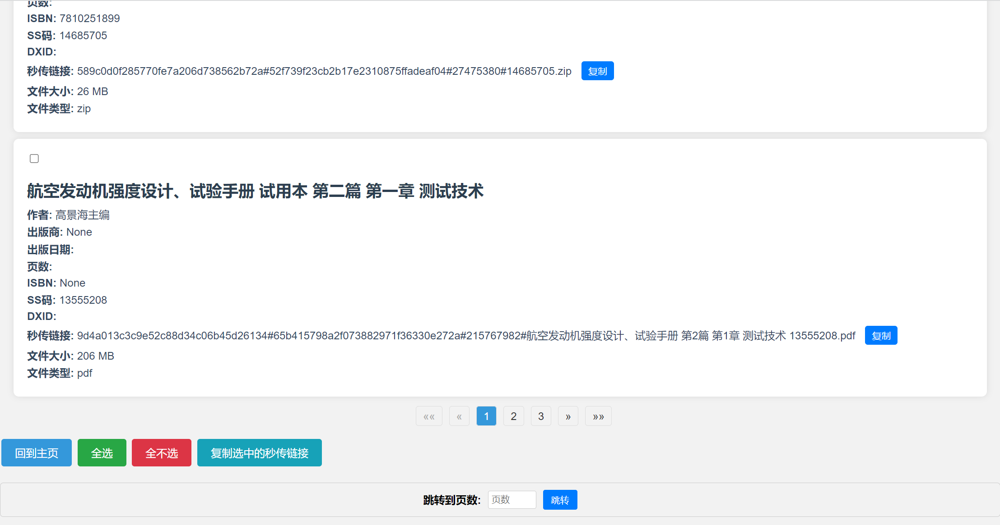

# EbookDatabase - Electronic Book Retrieval System ————— FROM CHATGPT4

[ENGLISH](README_EN.md) | [日本語](README_JP.md)

## Introduction

This is a localized electronic book retrieval system that supports advanced search queries.

The project is built using FastAPI and a SQLite database and can be easily deployed with the distribution package provided by this project.

The database provided by this project is aggregated from many channels, so there may be incomplete information and other issues. Please understand.

If you find errors in the database content or have good content you want to share with others, please contact me.

If there are many participants, the database will be updated regularly. Everyone contributes, and everyone benefits.

You can join a group chat to interact with like-minded people.

QQ Group: 942385978




## Database Backup

### [Click to view the database list](Markdown/Database_Download_Document.md)

## Quick Start

Video:

YouTube: https://youtu.be/-jD8OsF6di4

bilibili: https://www.bilibili.com/video/BV1fN4y1r7fP/

Other repository address: https://gitee.com/etojsyc/EbookDatabase

### Local Running

---

#### Method 1 (Recommended! Run using the release package)

1. Download the software package released by this project.

2. Unzip the downloaded package.

3. Download the project's database file and place it in the instance folder.

4. Double-click the exe to start the project with one click.

5. Then use it at http://127.0.0.1:10223/.

---

#### Method 2 (Run using source code)

1. Open a terminal or command prompt, and navigate to the root directory of your project.

2. Create a new virtual environment. You can use the following command:

```python
python -m venv venv
```

This will create a new virtual environment named `venv` in the project root directory.

3. Activate the virtual environment. On Windows, use the following command:

```python
venv\Scripts\activate
```

On macOS and Linux, use the following command:

```python
source venv/bin/activate
```

Once the virtual environment is activated, the virtual environment name will appear in front of the terminal prompt, indicating that it is active.

4. Next, install the dependencies required for the project. Use the following command to install dependencies in the virtual environment:

```python
pip install -r requirements.txt
```

This will install all the dependencies required for the project according to the `requirements.txt` file, and these dependencies will only be available in the virtual environment.

5. Finally, run the application. Use the following command to start the application:

```python
python app.py
```
This will run the application in the virtual environment, and then use it at http://127.0.0.1:10223/.

---
#### Method 3 (Build a Windows executable using source code)

Build a Windows executable using source code.

1. Make sure you are executing this step on Windows.

2. Operate the same as in Method 2, but in the fifth step, use the following command to build the application:

```python
python setup.py build
```

This will create a new directory named `build` in the project root directory, which contains the built application.

---
#### Method 4 (Deploy using Docker)

1. Pull the image directly from dockerhub

   ```bash
   docker push hellohistory/ebookdatabase:tagname
   ```
2. After the build is complete, run the following command to start the container:

   ```bash
   docker run -v /path/to/instance:/app/instance -v /path/to/logs:/app/logs  -p 10223:10223 ebookdatabase
   ```
You need to replace /path/to/instance with your local database file path, and /path/to/logs with your local log file path.

This will start a Docker container named `ebookdatabase` and map the container's 10223 port to the same port on the host.

3. Visit `http://127.0.0.1:10223/` in your browser to use the app.


---
#### Method 5 (Build and use a Docker container on your own)

Build and use a Docker container on your own.

1. Make sure Docker is installed on your system. If not, refer to the installation guide on the [Docker official website](https://www.docker.com/).

2. Clone or download the source code of this project to your local environment. Make sure the `Dockerfile` is in the project root directory.

3. In the terminal or command prompt, navigate to the project root directory and run the following command to build the Docker image:

   ```bash
   docker build -t ebookdatabase .
   ```

4. After the build is complete, run the following command to start the container:

   ```bash
   docker run -v /path/to/instance:/app/instance  -p 10223:10223 ebookdatabase
   ```
   You need to replace /path/to/instance with your local database file path.

   This will start a Docker container named `ebookdatabase` and map the container's 10223 port to the same port on the host.

5. Visit `http://127.0.0.1:10223/` in your browser to use the app.

---

## Features

- Supports local basic search and advanced search
- Supports fuzzy and precise search
- Displays results with pagination




## Bug Reporting

If you encounter problems while running this project, please submit issues as follows:

```bash
1. Operating environment

2. Search conditions used

3. Screenshot of the error screen
```

## Statement
   ```
This project is only for learning and communication purposes and is prohibited from being used in any commercial scenarios.

This project will never authorize anyone to use it for commercial purposes in any form. Any commercial scenario claiming to use this project is a rumor.

If rights are infringed, please contact the project for deletion.

This project assumes no responsibility. All responsibility is borne by the user. Please read the license file for details.
   ```