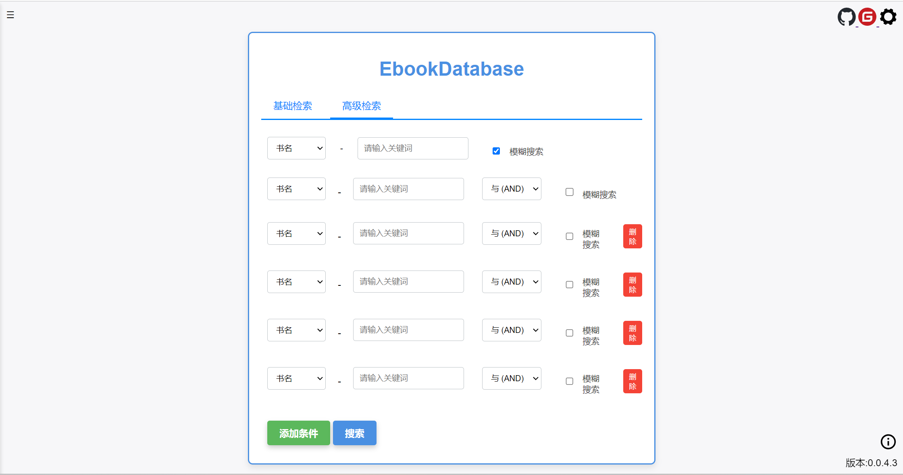

# EbookDatabase - 电子书籍检索系统

## 简介

这是本地化检索的电子数据。该项目使用 FastAPI 和 SQLite 数据库构建，并可以通过 本地 与 Docker 轻松部署。

目前本项目包含的数据库：

读秀2.0-5.0

这个数据库是通过很多渠道汇集到一起形成的，所以会出现信息不全等种种情况发生，还望谅解。

如果你发现数据库内容错误或者有好的内容想要与大家分享，请与本人联系，

如果参与的人多，数据库会定期更新，人人为我，我为人人。

可以添加群聊与同好一起交流

QQ群：942385978



## 数据库备份

数据库备份可以通过以下网盘链接获取：

- [123网盘链接](https://www.123pan.com/s/oNv9-zWI2.html)  提取码:dx25
- [arlenzhang256提供的链接](https://cloud.zyuan.xyz/s/kR5s6) 在此表示感谢
- 688f06358afa3ebab06f6d0ebe029c9c#3414196224#DX_2.0-5.0.db    感谢OpenSSL提供的百度网盘秒传链接

## 快速开始

视频：

YouTube：https://youtu.be/-jD8OsF6di4

bilibili：https://www.bilibili.com/video/BV1fN4y1r7fP/

### 本地运行

#### 方法一


1. 打开终端或命令提示符，并导航到您项目的根目录。

2. 创建一个新的虚拟环境，您可以使用以下命令：

```python
python -m venv venv
```

这将在项目根目录中创建一个名为`venv`的新虚拟环境。

3. 激活虚拟环境。在 Windows 上，使用以下命令：

```python
venv\Scripts\activate
```

在 macOS 和 Linux 上，使用以下命令：

```python
source venv/bin/activate
```

激活虚拟环境后，终端前面的提示符会显示虚拟环境名称，表示虚拟环境已经激活。

4. 接下来，安装项目所需的依赖。使用以下命令在虚拟环境中安装依赖：

```python
pip install -r requirements.txt
```

这将会根据`requirements.txt`文件安装项目所需的所有依赖，而且这些依赖将仅在虚拟环境中可用。

5. 最后，运行应用程序。使用以下命令启动应用程序：

```python
python app.py
```

这将在虚拟环境中运行应用程序，然后在 http://localhost:10223/ 上使用它。

---

#### 方法二

1. 下载本项目发布的软件包

2. 解压下载下来的软件包

3. 下载本项目的数据库文件并且存放到instance文件夹

4. 点击启动.bat一键启动本项目

5. 然后在 http://127.0.0.1:10223/ 上使用它。

---

### 使用 Docker 运行

1. 首先，确保您已经安装了 [Docker](https://www.docker.com/products/docker-desktop)。

2. 克隆此仓库：

    ```bash
    git clone https://github.com/Hellohistory/DX2_5.git
    cd your-repo-dir
    ```

3. 构建 Docker 镜像：

    ```bash
    docker build -t dx2_5 .
    ```

4. 运行 Docker 容器：

    ```bash
    docker run -p 10223:10223 dx2_5
    ```

这样就可以在 `http://localhost:10223/`当中使用

## Docker 容器存储设置

在 Dockerfile 中，使用 `RUN mkdir /app/instance` 命令来在容器的 `/app` 工作目录下创建一个名为 `instance` 的文件夹。这个文件夹用于存放 SQLite 数据库。

为了使这个数据库文件夹能够从外部访问并持久化存储，可以在运行 Docker 容器时使用 `-v` 参数来将这个 `instance` 文件夹映射到宿主机的一个特定目录。

   ```bash
   docker run -v /path/to/instance:/app/instance -v /path/to/logs:/app/logs your-image-name
   ```

这里，`/path/to/instance` 和 `/path/to/logs` 是在宿主机上用于存放数据库和日志的目录。


## 功能

- 本地化检索
- 支持模糊搜索和准确搜索
- 分页显示结果


## Bug反馈

在运行本项目的时候出现问题，请提交issues反馈，反馈格式如下
```bash
1.运行环境

2.使用的查询条件

3.错误界面截图
```

## 声明
   ```
本项目仅用于学习交流，禁止使用到任何的商业场景当中

本项目绝对不会以任何形式授权任何人用于商业用途，任何商业场景申明使用到本项目均为造谣

如若侵犯权益，请联系本项目删除

本项目不承担任何责任，责任均由使用者负责，详情请阅读许可证文件
   ```
