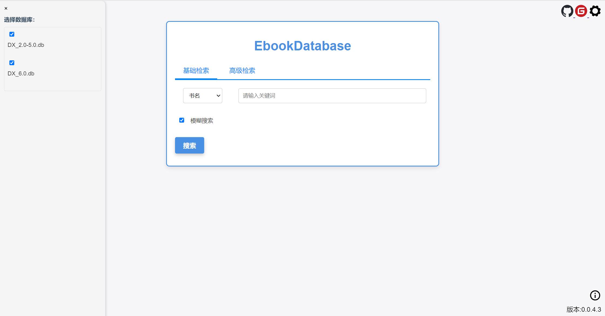
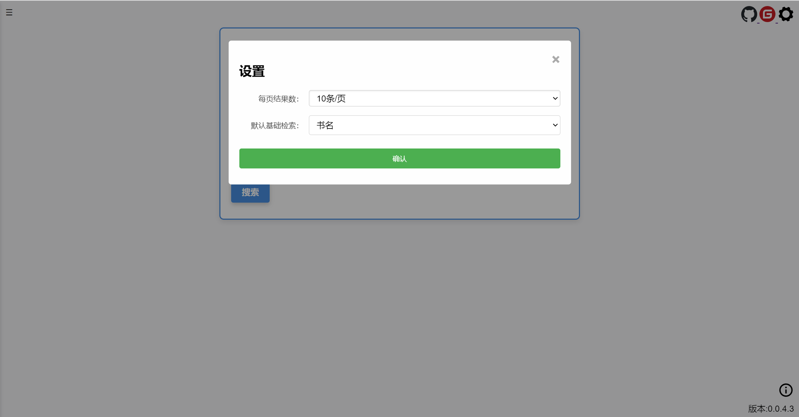

# EbookDatabase - 电子书籍检索系统

[ENGLISH](Markdown/README_EN.md) | [日本語](Markdown/README_JP.md) | [正體中文](Markdown/README_ZH.md)

## 简介

这是一款本地化的电子书检索系统，支持使用高级检索进行查询。

该项目使用 FastAPI 和 SQLite 数据库构建，并可以通过本项目发行包轻松部署。

本项目提供的数据库是通过很多渠道汇集到一起形成的，所以会出现信息不全等种种情况发生，还望谅解。

如果你发现数据库内容错误或者有好的内容想要与大家分享，请与本人联系，

如果参与的人多，数据库会定期更新，人人为我，我为人人。

可以添加群聊与同好一起交流

QQ群：942385978




## 数据库备份与EbookDataTools工具的下载

### [点击查看数据库列表](Markdown/数据库下载文档.md)

### [点击查看EbookDataTools工具下载](Markdown/EbookDataTools.md)

## 违反项目协议的曝光

### [点击查看违反协议的曝光](Markdown/Pillory.md)

## 快速开始

视频：

YouTube：https://youtu.be/-jD8OsF6di4

bilibili：https://www.bilibili.com/video/BV1fN4y1r7fP/

其他仓库地址：https://gitee.com/etojsyc/EbookDatabase

### 本地运行

---

#### 方法一 (推荐！使用发布包运行)

1. 下载本项目发布的软件包

2. 解压下载下来的软件包

3. 下载本项目的数据库文件并且存放到instance文件夹

4. 双击exe一键启动本项目

5. 然后在 http://127.0.0.1:10223/ 上使用它。

---

#### 方法二 (使用源代码运行)


1. 打开终端或命令提示符，并导航到您项目的根目录。

2. 创建一个新的虚拟环境，您可以使用以下命令：

```python
python -m venv venv
```

这将在项目根目录中创建一个名为`venv`的新虚拟环境。

3. 激活虚拟环境。在 Windows 上，使用以下命令：

```python
venv\Scripts\activate
```

在 macOS 和 Linux 上，使用以下命令：

```python
source venv/bin/activate
```

激活虚拟环境后，终端前面的提示符会显示虚拟环境名称，表示虚拟环境已经激活。

4. 接下来，安装项目所需的依赖。使用以下命令在虚拟环境中安装依赖：

```python
pip install -r requirements.txt
```

这将会根据`requirements.txt`文件安装项目所需的所有依赖，而且这些依赖将仅在虚拟环境中可用。

5. 最后，运行应用程序。使用以下命令启动应用程序：

```python
python app.py
```
这将在虚拟环境中运行应用程序，然后在 http://127.0.0.1:10223/ 上使用它。

---
#### 方法三(使用源代码构建Windows可执行程序)

使用源代码构建Windows可执行程序

1. 确保您是在Windows上执行本步骤

2. 与方法二上一样的操作，但是在第五步中，使用以下命令构建应用程序：

```python
python setup.py build
```

这将在项目根目录中创建一个名为`build`的新目录，其中包含构建的应用程序。

---
#### 方法四(使用Docker部署)

1. 从dockerhub直接拉取镜像

   ```bash
   docker pull hellohistory/ebookdatabase:需要下载的版本号
   ```
2. 构建完成后，运行以下命令以启动容器：

   ```bash
   docker run -v /path/to/instance:/app/instance -v /path/to/logs:/app/logs  -p 10223:10223 ebookdatabase
   ```
您需要将/path/to/instance替换为您本地的数据库文件存放路径，/path/to/logs替换为您本地的日志文件存放路径。

这将启动一个名为 `ebookdatabase` 的 Docker 容器，并将容器的 10223 端口映射到主机的同一端口。

3. 在浏览器中访问 `http://127.0.0.1:10223/` 以使用应用。


---
#### 方法五(自行构建 Docker 容器进行使用)

自行构建 Docker 容器进行使用

1. 确保您的系统已安装 Docker。如果尚未安装，请参阅 [Docker 官方网站](https://www.docker.com/) 上的安装指南。

2. 克隆或下载本项目的源码到您的本地环境。确保 `Dockerfile` 文件位于项目根目录中。

3. 在终端或命令提示符中，导航到项目根目录，并运行以下命令构建 Docker 镜像：

   ```bash
   docker build -t ebookdatabase .
   ```

4. 构建完成后，运行以下命令以启动容器：

   ```bash
   docker run -v /path/to/instance:/app/instance  -p 10223:10223 ebookdatabase
   ```
   您需要将/path/to/instance替换为您本地的数据库文件存放路径。

   这将启动一个名为 `ebookdatabase` 的 Docker 容器，并将容器的 10223 端口映射到主机的同一端口。

5. 在浏览器中访问 `http://127.0.0.1:10223/` 以使用应用。

---

## 功能

- 支持本地基础检索和高级检索
- 支持模糊搜索和准确搜索
- 分页显示结果




## Bug反馈

在运行本项目的时候出现问题，请提交issues反馈，反馈格式如下
```bash
1.运行环境

2.使用的查询条件

3.错误界面截图
```

## 声明
   ```
本项目仅用于学习交流，禁止使用到任何的商业场景当中

本项目绝对不会以任何形式授权任何人用于商业用途，任何商业场景申明使用到本项目均为造谣

如若侵犯权益，请联系本项目删除

本项目不承担任何责任，责任均由使用者负责，详情请阅读许可证文件
   ```
